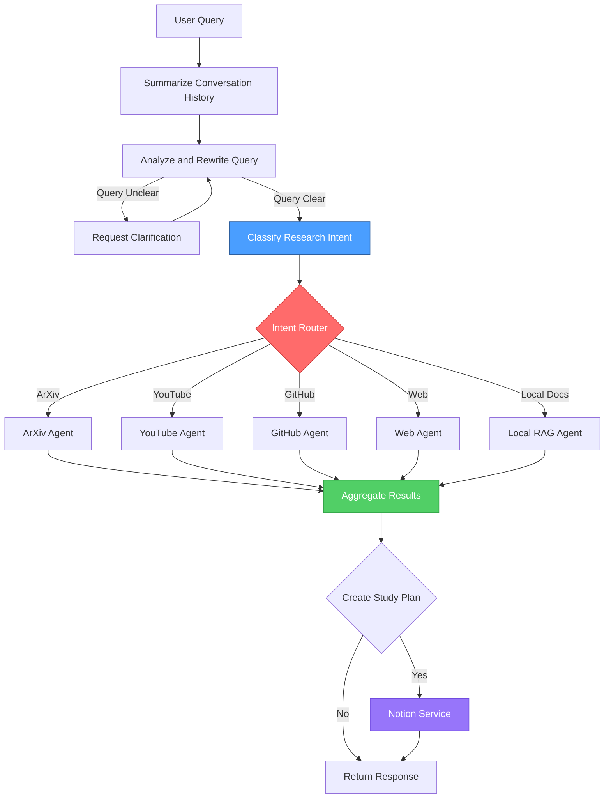

# 🔬 Research Copilot

An AI-powered research assistant that helps you explore, analyze, and synthesize information from multiple sources including local documents, academic papers, web content, GitHub repositories, and YouTube videos.

## 🏗️ System Architecture



**Key Architecture Features:**
- **LLM-Powered Intent Classification**: Analyzes user queries to determine which specialized agents to invoke (ArXiv for papers, GitHub for code, YouTube for videos, etc.)
- **Parallel Agent Execution**: Uses LangGraph's `Send` objects to execute multiple agents simultaneously, reducing latency
- **Smart Query Rewriting**: Breaks down complex queries into optimized sub-queries for each agent
- **Citation Tracking**: Each agent collects sources with metadata (title, URL, snippet, source type) that flow through the pipeline
- **Dynamic Aggregation**: LLM synthesizes responses from multiple agents into a coherent answer with proper citations
- **Optional Study Plan Generation**: Results can be transformed into structured Notion pages with learning objectives, phases, and resources

## 🌟 Features

### Multi-Source Research
- **Local RAG (Retrieval-Augmented Generation)**: Upload and query your own PDF and Markdown documents
- **ArXiv Integration**: Search and analyze academic papers
- **Web Search**: Intelligent web search with Tavily integration
- **GitHub Integration**: Explore code repositories and documentation
- **YouTube Analysis**: Extract insights from video transcripts

### Intelligent Agent System
- **Orchestrated Multi-Agent Architecture**: Uses LangGraph to coordinate specialized agents
- **Smart Query Routing**: Automatically selects the best agents for your research needs
- **Citation Tracking**: Provides detailed source citations and references
- **Context-Aware Responses**: Synthesizes information across multiple sources
- **Notion Export**: Generate structured study plans and export them directly to Notion

### Advanced RAG Capabilities
- **Semantic Chunking**: Intelligent document splitting for better context
- **Parent-Child Document Storage**: Retrieves context while maintaining precision
- **LLM-based Reranking**: Ensures the most relevant results
- **Vector Database**: Powered by Qdrant for efficient similarity search

## 🚀 Quick Start

### Prerequisites

- **Python**: 3.11+ (tested with Python 3.11)
- **Conda**: Recommended for environment management
- **API Keys**: You'll need API keys for various services (see Configuration section)

### Installation

1. **Clone the repository**:
   ```bash
   git clone https://github.com/yourusername/research-copilot.git
   cd research-copilot
   ```

2. **Create and activate a conda environment**:
   ```bash
   conda create -n research311 python=3.11 -y
   conda activate research311
   ```

3. **Install the package**:
   ```bash
   pip install -e .
   ```
   
   This will install all required dependencies including:
   - LangChain and LangGraph for agent orchestration
   - Qdrant for vector storage
   - Google Gemini, OpenAI, and Ollama LLM integrations
   - Tavily for web search
   - ArXiv, YouTube, and GitHub API clients
   - Gradio for the UI
   - MCP (Model Context Protocol) support
   - And many more (see `pyproject.toml`)
   
   **Optional: Install GCP deployment dependencies** (if deploying to Google Cloud):
   ```bash
   pip install -e ".[gcp]"
   ```

### Configuration

Create a `.env` file in the root directory or set environment variables for your API keys:

```bash
# Google Gemini (recommended for main LLM)
GOOGLE_API_KEY=your-google-gemini-api-key

# Tavily (for web search)
TAVILY_API_KEY=your-tavily-api-key

# GitHub (for GitHub agent)
GITHUB_TOKEN=your-github-token

# Notion Integration (for study plan export)
NOTION_API_KEY=your-notion-integration-token
NOTION_PARENT_PAGE_ID=your-parent-page-uuid
```

#### Notion API Setup

Research Copilot uses **direct Notion API calls** to create study plan pages. To set up Notion integration:

1. **Create a Notion Integration**:
   - Go to [Notion Developers](https://developers.notion.com/)
   - Click "New integration"
   - Give it a name (e.g., "Research Copilot")
   - Select the workspace where you want to create pages
   - Copy the "Internal Integration Token" → this is your `NOTION_API_KEY`

2. **Get Your Parent Page ID**:
   - Open the Notion page where you want study plans to be created
   - Click "Share" → "Copy link"
   - The URL format is: `https://www.notion.so/PageName-<UUID>`
   - Extract the UUID (32 hex characters after the last dash) → this is your `NOTION_PARENT_PAGE_ID`

3. **Share the Page with Your Integration**:
   - Open your parent page in Notion
   - Click "..." (menu) → "Add connections"
   - Search for and select your integration
   - This grants the integration permission to create child pages

#### MCP Server Configuration (Optional)

Research Copilot supports **local MCP servers** via stdio (standard input/output) protocol for enhanced tool capabilities. This is the recommended approach as it provides better reliability and lower latency compared to remote servers.

```bash
# Enable MCP servers (optional - defaults to direct API calls)
USE_GITHUB_MCP=true
USE_WEB_SEARCH_MCP=false
USE_NOTION_MCP=false

# Local MCP server commands (stdio transport)
# GitHub MCP: Uses npx to spawn the official MCP server
GITHUB_MCP_COMMAND=npx,-y,@modelcontextprotocol/server-github

# Web Search MCP (if using MCP instead of direct Tavily API)
WEB_SEARCH_MCP_COMMAND=python,-m,research_copilot.tools.mcp.web_search_mcp

# Notion MCP (if using MCP instead of direct API)
NOTION_MCP_COMMAND=npx,-y,@modelcontextprotocol/server-notion
```

**How Local MCP Works**:
- MCP servers are spawned as child processes
- Communication happens via stdin/stdout (stdio transport)
- No network overhead - everything runs locally
- The adapter (`research_copilot/tools/mcp/adapter.py`) handles connection lifecycle

**When to Use MCP vs Direct API**:
- **Direct API** (default): Simpler setup, fewer dependencies, recommended for most users
- **MCP Server**: Use when you need advanced features from official MCP servers or want to integrate with the broader MCP ecosystem

### Launch the Application

```bash
# Activate your conda environment
conda activate research311

# Run the application
python -m research_copilot.app.main
```

Or alternatively:
```bash
python research_copilot/app/main.py
```

The application will launch at `http://127.0.0.1:7860` 🎉

## 📖 Usage

### 1. Documents Tab 📄
- Upload PDF or Markdown files to your knowledge base
- View all indexed documents
- Clear or refresh your document collection

### 2. Chat Tab 💬
- Ask questions about your uploaded documents
- Get AI-powered answers with source citations
- Interactive chat interface with message history

### 3. Research Tab 🔬
- Perform multi-source research queries
- Automatically searches across:
  - Your local documents
  - ArXiv papers
  - Web content
  - GitHub repositories
  - YouTube videos
- View detailed citations and source summaries

## 🏗️ Architecture

```
research_copilot/
├── agents/          # Specialized agents (RAG, ArXiv, Web, GitHub, YouTube)
├── orchestrator/    # LangGraph orchestration layer
├── core/           # Core systems (RAG, document management, chat)
├── rag/            # RAG components (chunking, retrieval, reranking)
├── storage/        # Database managers (Qdrant, cache, parent store)
├── tools/          # Agent tools and registry
├── ui/             # Gradio interface and CSS
├── config/         # Configuration management
└── app/            # Application entry point
```

## 🛠️ Development

### Project Structure

The project follows a modular architecture:

- **Agents**: Each agent (`local_rag_agent.py`, `arxiv_agent.py`, etc.) specializes in a specific data source
- **Orchestrator**: Uses LangGraph to route queries and coordinate agents
- **RAG System**: Advanced retrieval with parent-child chunking and reranking
- **Storage**: Qdrant vector DB with parent document store and research cache

### Running Tests

```bash
pytest tests/
```

### Adding New Agents

1. Create a new agent in `agents/` inheriting from `BaseAgent`
2. Implement the required methods
3. Register the agent in `tools/registry.py`
4. Update the orchestrator to include the new agent

## 🎨 UI Customization

The UI uses a modern dark theme with custom CSS. You can modify the styling in:
- `research_copilot/ui/css.py` - Custom CSS variables and styles
- `research_copilot/ui/gradio_app.py` - Gradio theme configuration

## 📦 Dependencies

Key dependencies:
- **langchain & langgraph** - LLM application framework and agent orchestration
- **qdrant-client** - Vector database for semantic search
- **langchain-google-genai** - Google Gemini integration (recommended)
- **langchain-tavily** - Web search integration
- **gradio** - Web UI framework
- **arxiv, youtube-transcript-api, PyGithub** - Source-specific API clients
- **pymupdf, pypdf** - PDF processing
- **sentence-transformers, fastembed** - Embedding models
- **mcp, langchain-mcp-adapters** - Model Context Protocol support
- **pydantic, python-dotenv** - Configuration management

See `pyproject.toml` for the complete list.

## 🚧 Current Limitations & Future Roadmap

### Known Limitations

1. **No Persistent Database**
   - All chat history and research results are stored in-memory on the web page
   - Clearing the browser or restarting the application loses all session data
   - **Planned**: Integration with PostgreSQL or SQLite for persistent storage of conversations, research sessions, and document metadata

2. **No OAuth for Notion Integration**
   - Current Notion integration requires manually configured API keys and parent page IDs
   - All study plans are created under the same predefined parent page
   - Users cannot connect their own Notion workspaces without author credentials
   - **Planned**: Implement OAuth 2.0 flow to allow users to:
     - Authenticate with their own Notion accounts
     - Select their own parent pages dynamically
     - Manage multiple workspace connections
     - Store OAuth tokens securely in the database

3. **Limited Multi-User Support**
   - Application is designed for single-user local deployment
   - No user authentication or session isolation
   - **Planned**: Multi-tenant architecture with user accounts and isolated workspaces

4. **No Research Session Management**
   - Cannot save/load specific research sessions
   - Cannot organize research by project or topic
   - **Planned**: Session management UI with tagging, categorization, and search

### Contributing

We welcome contributions to address these limitations or add new features! Please check the issues page or open a new issue to discuss improvements.

