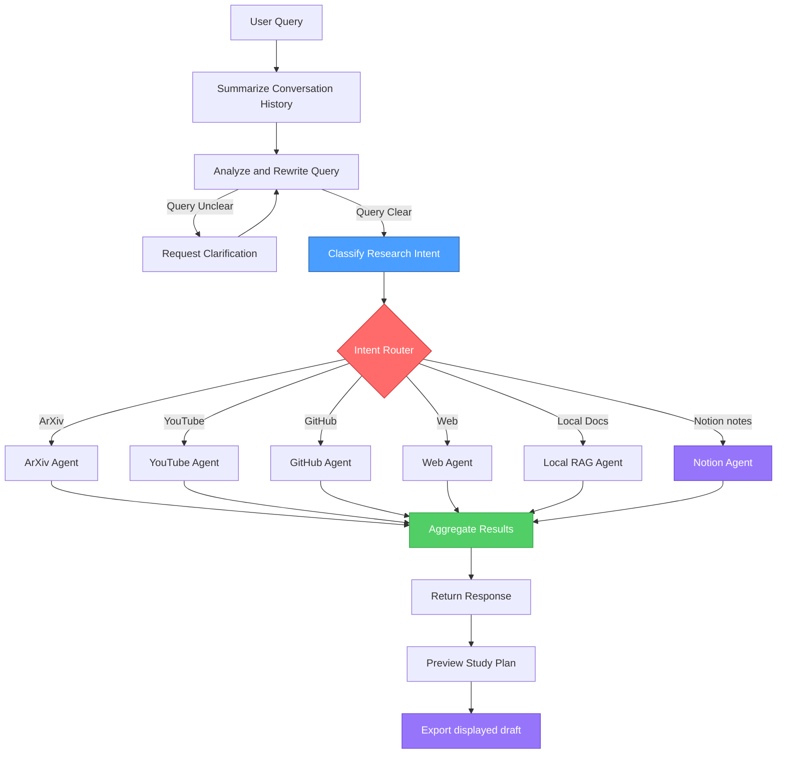

# Research Copilot

A local, single-user research assistant that searches local documents, academic papers, the web, GitHub, YouTube, and a connected Notion workspace. After research, you can preview a study plan and export that exact draft to a Notion page you choose.

This release is a Gradio application mounted under FastAPI at `/ui`. Notion OAuth binds to `127.0.0.1` only.

## Architecture


```mermaid
flowchart TD
    Start[User Query] --> Summarize[Summarize Conversation History]
    Summarize --> AnalyzeRewrite[Analyze and Rewrite Query]

    AnalyzeRewrite -->|Query Unclear| HumanInput[Request Clarification]
    HumanInput --> AnalyzeRewrite

    AnalyzeRewrite -->|Query Clear| ClassifyIntent[Classify Research Intent]

    ClassifyIntent --> Router{Intent Router}

    Router -->|ArXiv| ArXivAgent[ArXiv Agent]
    Router -->|YouTube| YouTubeAgent[YouTube Agent]
    Router -->|GitHub| GitHubAgent[GitHub Agent]
    Router -->|Web| WebAgent[Web Agent]
    Router -->|Local Docs| LocalAgent[Local RAG Agent]
    Router -->|Notion notes| NotionAgent[Notion Agent]

    ArXivAgent --> Aggregate[Aggregate Results]
    YouTubeAgent --> Aggregate
    GitHubAgent --> Aggregate
    WebAgent --> Aggregate
    LocalAgent --> Aggregate
    NotionAgent --> Aggregate

    Aggregate --> End[Return Response]
    End --> Preview[Preview Study Plan]
    Preview --> Export[Export displayed draft]

    style ClassifyIntent fill:#4a9eff,stroke:#2d5f9f,color:#ffffff
    style Router fill:#ff6b6b,stroke:#c92a2a,color:#ffffff
    style Aggregate fill:#51cf66,stroke:#2f9e44,color:#ffffff
    style NotionAgent fill:#9775fa,stroke:#6741d9,color:#ffffff
    style Export fill:#9775fa,stroke:#6741d9,color:#ffffff
```

**How a request runs**
- The orchestrator classifies intent against **currently available sources**. Notion is offered only while a workspace connection is active.
- Specialized agents run in parallel. Notion research tools are read-only search and fetch.
- Citations from Notion require a fetched page (title, URL, and content). Search hits alone are not treated as evidence.
- Study-plan publishing is not part of the research graph. Preview generates a draft; Export publishes the displayed Markdown without generating again.

**Layout**
```
research_copilot/
├── agents/          # Source agents, including Notion
├── orchestrator/    # LangGraph routing, intent, aggregation
├── core/            # RAG, chat interface, document management
├── rag/             # Chunking, retrieval, reranking
├── storage/         # Qdrant, parent store, Keychain OAuth, export ledger
├── tools/           # Toolkits, registry, MCP client/adapter/OAuth
├── notion/          # Draft generation, REST publish, MCP publish, Markdown renderer
├── ui/              # Gradio UI
├── config/          # Shared local/GCP settings, including MCP
└── app/             # FastAPI factory, OAuth callback routes
```

## Features

- **Local RAG**: upload PDF and Markdown files and query them
- **ArXiv, web, GitHub, YouTube**: specialized research agents
- **Notion research**: search and fetch notes from one OAuth-connected workspace
- **Preview then export**: generate a study plan, inspect the Markdown, choose a destination page, then publish
- **Local OAuth**: Connect/Disconnect in the Research tab; tokens live in macOS Keychain

## Quick start

### Prerequisites

- Python 3.11 (compatibility baseline for this MCP stack)
- macOS Keychain if you use Notion MCP OAuth
- API keys for the LLM and any non-Notion sources you enable

### Installation

`pyproject.toml` pins the tested Python 3.11 baseline: MCP 1.25.0, `langchain-mcp-adapters` 0.2.1, LangChain 1.2.0, LangChain Core 1.2.6, and LangGraph 1.0.5. Keep MCP below v2.

```bash
conda create -n research311 python=3.11 -y
conda activate research311
pip install -e ".[test]"
```

Optional GCP extras:

```bash
pip install -e ".[gcp,test]"
```

### Configuration

Create a `.env` file:

```bash
# LLM
GOOGLE_API_KEY=your-google-gemini-api-key
LLM_PROVIDER=google
LLM_MODEL=gemini-2.5-flash

# Other research sources
TAVILY_API_KEY=your-tavily-api-key
GITHUB_TOKEN=your-github-token

# Notion: mcp (OAuth research + export), rest (legacy token export), or disabled
NOTION_BACKEND=mcp
OAUTH_BASE_URL=http://127.0.0.1:7860

# REST compatibility mode only (never used as an OAuth fallback)
# NOTION_BACKEND=rest
# NOTION_API_KEY=your-notion-integration-token
# NOTION_PARENT_PAGE_ID=your-parent-page-uuid

# Optional GitHub/web MCP stdio servers
# USE_GITHUB_MCP=true
# GITHUB_MCP_COMMAND=npx,-y,@modelcontextprotocol/server-github
# USE_WEB_SEARCH_MCP=false
```

`OAUTH_BASE_URL` must be `http://127.0.0.1:<port>` with no path. Gradio sharing and hosted multi-user OAuth are out of scope for this release.

### Launch

Both entrypoints use the same FastAPI application factory:

```bash
python -m research_copilot.app.main
# or
python app.py
```

Open `http://127.0.0.1:7860/ui`.

## Using Notion

1. Set `NOTION_BACKEND=mcp` and start the app on `127.0.0.1`.
2. In the Research tab, click **Connect Notion** and complete consent in the browser.
3. Restarting the app reuses Keychain credentials while the grant remains valid. You should not see another consent screen until access expires or you disconnect.
4. Ask a question that needs your notes (for example, “what did I write about MCP in Notion”). Ordinary research still works while disconnected.
5. After citations exist, click **Preview Study Plan**, search or paste a destination page, then **Export displayed plan**.
6. **Disconnect** stops new calls and deletes the local Keychain record. That does not revoke the grant in Notion; revoke access in Notion settings if you want the provider-side authorization removed.

OAuth failures never fall back to `NOTION_API_KEY`. REST export remains an explicit `NOTION_BACKEND=rest` compatibility mode that still uses the block renderer.

## Tests

```bash
pip install -e ".[test]"
pytest tests/
```

Stdio MCP tests use `tests/mcp/fixture_server.py`. OAuth and HTTP callback tests use mocked responses.

Opt-in live Notion smoke test (reads a page you choose; exports only with a second flag):

```bash
# After connecting in the UI:
NOTION_LIVE_TEST=1 NOTION_LIVE_PAGE_ID=<page-id-or-url> pytest tests/notion/test_live_smoke.py -m live

# Create a page only after you explicitly opt in:
NOTION_LIVE_TEST=1 NOTION_LIVE_EXPORT=1 NOTION_LIVE_PAGE_ID=<page-id> \
  NOTION_LIVE_PARENT_PAGE_ID=<destination-page-id> pytest tests/notion/test_live_smoke.py -m live
```

Record live verification separately from automated results. The live test does not disconnect your Keychain credentials.

## Known limitations

- One local profile and one active Notion workspace connection
- OAuth is loopback-only (`127.0.0.1`); no Gradio share and no hosted multi-user OAuth
- macOS Keychain is required for OAuth; there is no plaintext credential fallback
- Notion research is read-only; page creation is the Export button
- Export is not exactly-once across network failures. A timeout after dispatch is recorded as unknown and is not retried automatically. Inspect Notion before creating another page.
- Local disconnect does not revoke the Notion grant
- Persistent Notion research caching is disabled; connection-dependent in-memory results are cleared on disconnect or workspace change
- Chat history remains in-memory for the browser session
- Dynamic subagent spawning, general workspace editing, shared database storage, distributed refresh, cloud deployment, and a newer MCP stack are follow-up work
